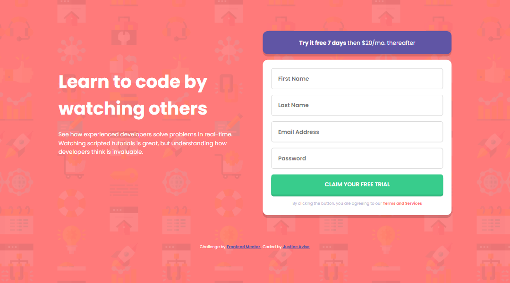
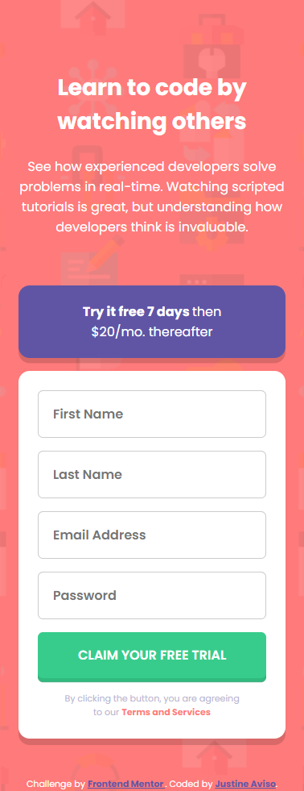

# Frontend Mentor - Intro component with sign up form solution

This is a solution to the [Intro component with sign up form challenge on Frontend Mentor](https://www.frontendmentor.io/challenges/intro-component-with-signup-form-5cf91bd49edda32581d28fd1). Frontend Mentor challenges help you improve your coding skills by building realistic projects.

## Table of contents

- [Overview](#overview)
  - [The challenge](#the-challenge)
  - [Screenshot](#screenshot)
- [My process](#my-process)
  - [Built with](#built-with)
  - [What I learned](#what-i-learned)
  - [Continued development](#continued-development)
  - [Useful resources](#useful-resources)
- [Author](#author)

**Note: Delete this note and update the table of contents based on what sections you keep.**

## Overview

### The challenge

Users should be able to:

- View the optimal layout for the site depending on their device's screen size
- See hover states for all interactive elements on the page
- Receive an error message when the `form` is submitted if:
  - Any `input` field is empty. The message for this error should say _"[Field Name] cannot be empty"_
  - The email address is not formatted correctly (i.e. a correct email address should have this structure: `name@host.tld`). The message for this error should say _"Looks like this is not an email"_

### Screenshot

### Links

- Solution URL: [Add solution URL here](https://www.frontendmentor.io/solutions/signup-component-using-vuejs-and-vuelidate-vhIkC0ckW)
- Live Site URL: [Add live site URL here](https://sign-up-component-jastenn.netlify.app/)

## My process

### Built with

- Semantic HTML5 markup
- CSS custom properties
- CSS variables
- Flexbox
- Mobile-first workflow
- [Vuejs](https://v3.vuejs.org/) - JS library
- [Vuelidate](https://v3.vuejs.org/) - For validations
- [CSS Modules](https://github.com/css-modules/css-modules) - For styles

**Note: These are just examples. Delete this note and replace the list above with your own choices**

### What I learned

I've learned a lot about vuejs with this challenge, I learn to write a cleaner and more readable template in vue when dealing with form. And on how to integrate vuelidate with vue3's composition api.

### Continued development

Using css variables that depends on another one another helps me manage those a little bit better. And I would continue to write a cleaner template by keeping utilizing some built in methods and by keeping my components small.

### Useful resources

- [Vuelidate Docs](https://vuelidate-next.netlify.app/) - This helps me learn to use vuelidate

## Author

- Frontend Mentor - [@eta1389](https://www.frontendmentor.io/profile/eta1389)
- Facebook - [Justine Aviso](https://www.facebook.com/aviso.jstn)
